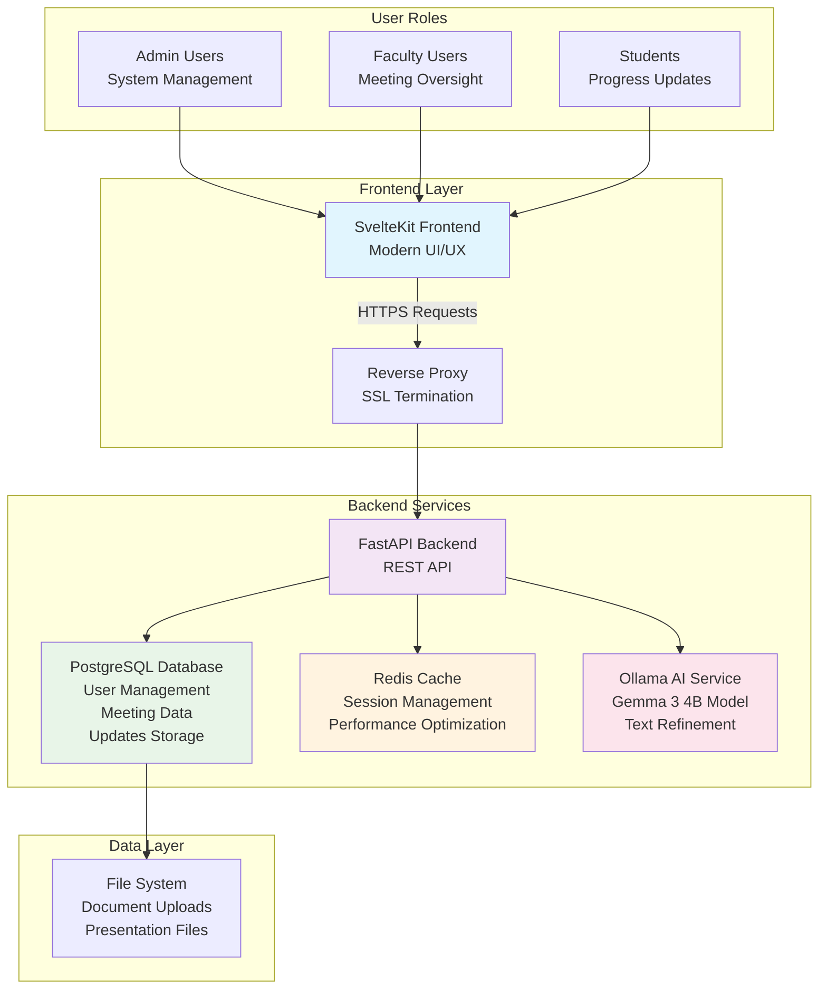

# 🎓 DoR-Dash (Dose of Reality Dashboard)

> A modern, responsive web application for managing student research meetings with AI-powered assistance

[](https://fastapi.tiangolo.com/)
[](https://kit.svelte.dev/)
[](https://postgresql.org/)
[](https://docker.com/)

## ✨ Features

DoR-Dash streamlines academic research management with intelligent automation and intuitive design:

### 🔐 Authentication & Security
- **Role-Based Access Control** - Multi-tier permissions for admins, faculty, and students
- **Registration Management** - Admin-approved user onboarding with request review system
- **Secure Sessions** - JWT-based authentication with Redis session management

### 🎨 Modern User Experience
- **Multi-Theme System** - 5 distinct themes including institutional branding (MBP Dark Fire, LSU Tigers)
- **Responsive Design** - Mobile-first responsive layout with glowing text effects
- **Dark Mode Support** - Professional dark themes with accessibility-compliant contrast ratios
- **About Page** - Comprehensive system architecture with interactive Mermaid diagrams
- **Easter Egg Navigation** - Brain-lightbulb icon for intuitive About page discovery

### 🤖 AI-Powered Features
- **Intelligent Text Refinement** - Gemma 3 4B model integration for academic writing enhancement
- **Quality Control** - Conservative prompts focused on grammar and clarity improvements
- **User Feedback System** - Star ratings and feedback collection for continuous improvement

### 📅 Meeting & Progress Management
- **Dynamic Meeting Agendas** - Auto-generated agendas from student submissions
- **Inline Editing** - Real-time update editing with file management capabilities
- **Progress Tracking** - Bi-monthly submissions with comprehensive dashboard analytics

### 📁 Advanced File Management
- **Full File Lifecycle** - Add, remove, and replace files within submissions
- **50MB Upload Limit** - Support for presentations, documents, and research files
- **Secure Storage** - Organized file structure with persistent storage

### 👥 Administration Tools
- **User Management** - Comprehensive admin controls with role assignment
- **Registration Oversight** - Review and approve new user requests
- **Dashboard Analytics** - System-wide visibility for administrators

### 📊 Faculty Features
- **Faculty Announcements** - Dedicated announcement system for faculty updates
- **Student Oversight** - Monitor student progress and meeting participation
- **Roster Management** - Access to student rosters and contact information

## 🏗️ System Architecture



## 🔄 Data Flow


## 🛠️ Technology Stack

| Component | Technology | Purpose |
|-----------|------------|---------|
| **Backend** | Python + FastAPI | High-performance REST API |
| **Frontend** | SvelteKit + Tailwind CSS | Modern, responsive UI |
| **Database** | PostgreSQL | Reliable data persistence |
| **Caching** | Redis | Session management & performance |
| **AI Engine** | Ollama + Gemma 3 4B | Text refinement & assistance |
| **Deployment** | Docker + Docker Compose | Containerized deployment |

## 📁 Project Structure


## 🚀 Quick Start

### Prerequisites

Ensure you have the following installed:
- Python 3.8+
- Node.js 16+
- Docker & Docker Compose
- PostgreSQL database access
- Redis server access
- Ollama with Gemma 3 4B model

### One-Command Setup

The fastest way to get DoR-Dash running:

```bash
# Clone and start everything
./scripts/start.sh
```

This automated script will:
1. ✅ Create environment configuration
2. ✅ Set up Python virtual environment
3. ✅ Install all dependencies
4. ✅ Apply database migrations
5. ✅ Start backend and frontend servers

To stop the application:
```bash
./scripts/stop.sh
```

### Manual Installation

<details>
<summary>Click to expand manual setup instructions</summary>

1. **Clone the repository**
   ```bash
   git clone <repository-url>
   cd DoR-Dash
   ```

2. **Environment Configuration**
   
   Create a `.env` file with your configuration:
   ```bash
   # Database Configuration
   POSTGRES_SERVER=your_postgres_host
   POSTGRES_PORT=5432
   POSTGRES_USER=your_db_user
   POSTGRES_PASSWORD=your_db_password
   POSTGRES_DB=your_database_name

   # Redis Configuration
   REDIS_SERVER=your_redis_host
   REDIS_PORT=6379

   # Security Settings
   SECRET_KEY=your_secure_secret_key_here
   ALGORITHM=HS256
   ACCESS_TOKEN_EXPIRE_MINUTES=30

   # AI Configuration
   OLLAMA_API_URL=http://your_ollama_host:11434/api/generate
   ```

3. **Backend Setup**
   ```bash
   python -m venv venv
   source venv/bin/activate  # On Windows: venv\Scripts\activate
   cd backend
   pip install -r requirements.txt
   alembic upgrade head
   ```

4. **Frontend Setup**
   ```bash
   cd frontend
   npm install
   ```

5. **Launch Services**
   ```bash
   # Terminal 1 - Backend
   cd backend
   uvicorn app.main:app --host 0.0.0.0 --port 8000 --reload

   # Terminal 2 - Frontend
   cd frontend
   npm run dev -- --host 0.0.0.0 --port 3000
   ```

</details>

### Docker Deployment

For containerized deployment:

```bash
# Development
docker-compose -f docker-compose.dev.yml up -d

# Production
docker-compose up -d
```

## 🔧 Development

### Backend Development

```bash
cd backend
pip install -r requirements-dev.txt
uvicorn app.main:app --reload --host 0.0.0.0 --port 8000

# Run tests
pytest

# Database migrations
alembic revision --autogenerate -m "description"
alembic upgrade head
```

### Frontend Development

```bash
cd frontend
npm install
npm run dev

# Build for production
npm run build

# Run tests
npm run test
```

## 📊 Key Features Deep Dive

### 🤖 AI-Powered Text Refinement
- Integrates with Ollama running Gemma 3 4B model for superior performance
- Conservative prompts focused on grammar, spelling, and punctuation only
- User feedback system with star ratings for continuous improvement
- Quality assurance framework to prevent over-enhancement

### 📅 Meeting Management System
- Interactive calendar with drag-and-drop functionality
- Automated agenda compilation from student submissions
- File attachment support for presentations and documents

### 👥 Role-Based Access Control
- **Admins**: Full system management and user administration
- **Faculty**: Meeting oversight and student progress monitoring  
- **Students**: Update submissions and file sharing

### 🗂️ Advanced File Management
- **Inline File Editing**: Add, remove, and replace files directly within submissions
- **File State Tracking**: Comprehensive management of existing, new, and removed files
- **50MB Upload Limit**: Support for presentations, documents, and research files
- **Secure Storage**: Organized file structure with persistent storage and validation

## 🔒 Security Features

- JWT-based authentication with secure token management
- Password hashing using industry-standard bcrypt
- Role-based authorization for all endpoints
- Input validation and sanitization
- Secure file upload handling

## 📈 Performance Optimizations

- **Redis Caching**: Session data and frequently accessed queries
- **Database Indexing**: Optimized queries for large datasets
- **Lazy Loading**: Efficient frontend component loading
- **API Rate Limiting**: Protection against abuse
- **Containerization**: Scalable deployment architecture

## 🧪 Testing

```bash
# Backend tests
cd backend
pytest

# Frontend tests
cd frontend
npm run test

# Integration tests
python test_deployment.py
```

## 📚 Documentation

- [Technical Notes](docs/technical-notes.md) - Detailed implementation notes
- [API Documentation](docs/api/) - Comprehensive API reference
- [Deployment Guide](docs/deployment/) - Production deployment instructions
- [QA Reports](qa/) - Quality assurance reports and analysis
- [CLAUDE.md](CLAUDE.md) - AI assistant guidance and project context

## 🆕 Recent Updates

### Version 2.0 Features (June 2025)
- ✅ **Enhanced Theme System**: Added MBP Dark Fire and LSU Tigers institutional themes
- ✅ **Advanced File Management**: Complete file lifecycle management within submissions
- ✅ **AI Model Upgrade**: Migrated from Mistral 7B to Gemma 3 4B for better performance
- ✅ **User Feedback System**: Star ratings and feedback collection for LLM improvements
- ✅ **Registration System**: Admin-approved user onboarding with request management
- ✅ **Faculty Announcements**: Dedicated system for faculty communications
- ✅ **Inline Editing**: Real-time update editing with comprehensive state management
- ✅ **Dashboard Consolidation**: Unified update tracking with role-based filtering
- ✅ **Quality Assurance**: Automated QA framework with regular health monitoring

### Bug Fixes & Improvements
- 🔧 Fixed white card backgrounds interfering with dark theme glow effects
- 🔧 Resolved user filtering issues ensuring proper data isolation
- 🔧 Enhanced registration error handling and validation
- 🔧 Improved role-based navigation permissions
- 🔧 Fixed agenda "undefined" display issues
- 🔧 Consolidated dashboard metrics for consistent user experience

## 🤝 Contributing

1. Fork the repository
2. Create a feature branch (`git checkout -b feature/amazing-feature`)
3. Commit your changes (`git commit -m 'Add amazing feature'`)
4. Push to the branch (`git push origin feature/amazing-feature`)
5. Open a Pull Request

## 📄 License

This project is licensed under the MIT License - see the [LICENSE](LICENSE) file for details.

---

<div align="center">

**Built with ❤️ for academic research management**

[Report Bug](https://github.com/your-repo/issues) · [Request Feature](https://github.com/your-repo/issues) · [Documentation](docs/)

</div>