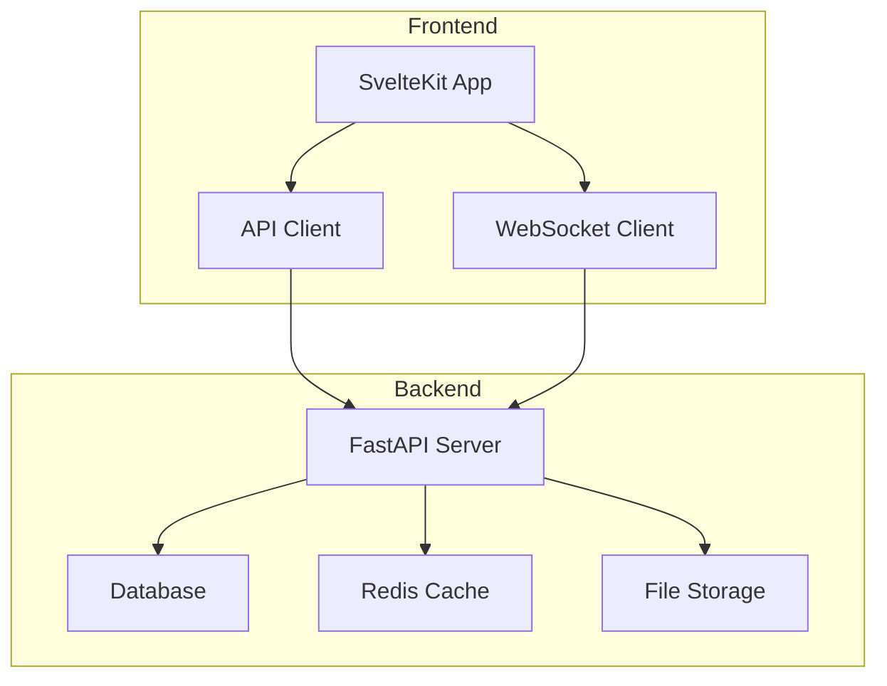

# Project Name

[](https://github.com/yourusername/yourproject/actions)
[](https://opensource.org/licenses/MIT)
[](https://www.codacy.com)
[](https://codecov.io/gh/yourusername/yourproject)

> Brief, compelling description of what your project does and why it matters.

## 🚀 Quick Start

```bash
# Clone the repository
git clone https://github.com/yourusername/yourproject.git
cd yourproject

# Run the setup script
./scripts/setup.sh

# Start the development environment
./scripts/start.sh
```

Visit `http://localhost:3000` to see the application running.

## 📋 Table of Contents

- [Features](#features)
- [Architecture](#architecture)
- [Installation](#installation)
- [Usage](#usage)
- [Development](#development)
- [Testing](#testing)
- [Deployment](#deployment)
- [Contributing](#contributing)
- [License](#license)

## ✨ Features

- **Feature 1**: Brief description of key feature
- **Feature 2**: Brief description of another feature
- **Feature 3**: Brief description of third feature
- **Real-time Updates**: WebSocket integration for live data
- **Security First**: Built with security best practices
- **Fully Documented**: Comprehensive documentation and examples

## 🏗️ Architecture



For detailed architecture documentation, see [docs/architecture/](docs/architecture/).

## 📦 Installation

### Prerequisites

- Node.js 18+ and npm/yarn/pnpm
- Python 3.11+
- Docker and Docker Compose
- PostgreSQL 15+ (or use Docker)
- Redis 7+ (or use Docker)

### Development Setup

1. **Clone and Install**:
   ```bash
   git clone https://github.com/yourusername/yourproject.git
   cd yourproject
   ./scripts/setup.sh
   ```

2. **Configure Environment**:
   ```bash
   cp .env.example .env
   # Edit .env with your configuration
   ```

3. **Start Services**:
   ```bash
   ./scripts/start.sh
   ```

For detailed installation instructions, see [docs/deployment/](docs/deployment/).

## 🔧 Usage

### Basic Example

```javascript
// Frontend example
import { api } from '$lib/api';

const data = await api.get('/items');
```

```python
# Backend example
from app.api import router

@router.get("/items")
async def get_items():
    return {"items": []}
```

### Advanced Features

See [docs/api/](docs/api/) for complete API documentation.

## 💻 Development

### Project Structure

```
.
├── frontend/          # SvelteKit frontend application
├── backend/           # FastAPI backend application
├── docs/             # Documentation
├── qa/               # Quality assurance resources
├── scripts/          # Utility scripts
├── subroutines/      # Development procedures
└── docker-compose.yml # Docker configuration
```

### Development Workflow

1. Create a feature branch: `git checkout -b feature/your-feature`
2. Make your changes following our [contribution guidelines](CONTRIBUTING.md)
3. Run tests: `./scripts/run-tests.sh`
4. Submit a pull request

### Code Style

This project uses:
- **Frontend**: Prettier, ESLint
- **Backend**: Black, Ruff, MyPy
- **Commits**: Conventional Commits

## 🧪 Testing

```bash
# Run all tests
./scripts/run-tests.sh

# Frontend tests only
npm run test

# Backend tests only
pytest

# E2E tests
npm run test:e2e
```

See [qa/test-plan-template.md](qa/test-plan-template.md) for testing guidelines.

## 🚀 Deployment

### Quick Deploy

```bash
# Deploy to production
./scripts/deploy.sh production

# Deploy to staging
./scripts/deploy.sh staging
```

### Docker Deployment

```bash
docker-compose -f docker-compose.yml up -d
```

For detailed deployment instructions, see [docs/deployment/](docs/deployment/).

## 🤝 Contributing

We welcome contributions! Please see our [Contributing Guidelines](CONTRIBUTING.md) for details.

### Development Process

1. Check existing issues or create a new one
2. Fork the repository
3. Create your feature branch
4. Commit your changes
5. Push to your fork
6. Submit a pull request

## 📄 License

This project is licensed under the MIT License - see the [LICENSE](LICENSE) file for details.

## 🙏 Acknowledgments

- Built with the Cerebro-Stack template
- Inspired by best practices from the open-source community
- Special thanks to all contributors

---

<p align="center">
  Made with ❤️ by [Your Team Name]
</p>