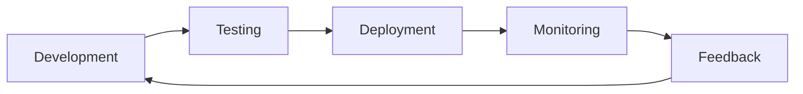

# Quality Assurance Framework

This document outlines the comprehensive quality assurance framework for the project, including testing strategies, quality gates, and continuous improvement processes.

## Table of Contents

- [Overview](#overview)
- [Testing Strategy](#testing-strategy)
- [Quality Gates](#quality-gates)
- [Test Automation](#test-automation)
- [Code Quality](#code-quality)
- [Performance Testing](#performance-testing)
- [Security Testing](#security-testing)
- [Accessibility Testing](#accessibility-testing)
- [Browser Compatibility](#browser-compatibility)
- [Mobile Testing](#mobile-testing)
- [Load Testing](#load-testing)
- [Monitoring and Reporting](#monitoring-and-reporting)

## Overview

Our QA framework ensures high-quality software delivery through:
- **Comprehensive Testing**: Multiple testing layers and types
- **Automation**: Continuous integration and automated testing
- **Quality Gates**: Checkpoints to prevent defects from reaching production
- **Continuous Improvement**: Regular assessment and enhancement of processes

### Quality Objectives

1. **Reliability**: 99.9% uptime in production
2. **Performance**: Page load times < 2 seconds
3. **Security**: Zero critical vulnerabilities
4. **Accessibility**: WCAG 2.1 AA compliance
5. **Maintainability**: Technical debt ratio < 5%

## Testing Strategy

### Test Pyramid

```
    /\
   /  \     E2E Tests (10%)
  /____\    Integration Tests (20%)
 /______\   Unit Tests (70%)
```

### Testing Levels

#### 1. Unit Testing (70%)
- **Purpose**: Test individual components in isolation
- **Tools**: Jest, Vitest, Pytest
- **Coverage Target**: 80%+
- **Responsibility**: Developers

**Frontend Unit Tests:**
```typescript
// Example: Component unit test
import { render, screen } from '@testing-library/svelte';
import UserCard from './UserCard.svelte';

describe('UserCard', () => {
  it('displays user information correctly', () => {
    const user = { id: '1', name: 'John Doe', email: 'john@example.com' };
    
    render(UserCard, { props: { user } });
    
    expect(screen.getByText('John Doe')).toBeInTheDocument();
    expect(screen.getByText('john@example.com')).toBeInTheDocument();
  });
  
  it('handles missing user data gracefully', () => {
    render(UserCard, { props: { user: null } });
    
    expect(screen.getByText('No user data')).toBeInTheDocument();
  });
});
```

**Backend Unit Tests:**
```python
# Example: Service unit test
import pytest
from unittest.mock import Mock, patch
from app.services.user_service import UserService

class TestUserService:
    def test_create_user_success(self):
        # Arrange
        user_data = {"email": "test@example.com", "name": "Test User"}
        mock_repo = Mock()
        mock_repo.create.return_value = {"id": "123", **user_data}
        
        service = UserService(mock_repo)
        
        # Act
        result = service.create_user(user_data)
        
        # Assert
        assert result["id"] == "123"
        assert result["email"] == "test@example.com"
        mock_repo.create.assert_called_once_with(user_data)
    
    def test_create_user_duplicate_email(self):
        # Arrange
        user_data = {"email": "existing@example.com", "name": "Test User"}
        mock_repo = Mock()
        mock_repo.create.side_effect = DuplicateEmailError()
        
        service = UserService(mock_repo)
        
        # Act & Assert
        with pytest.raises(DuplicateEmailError):
            service.create_user(user_data)
```

#### 2. Integration Testing (20%)
- **Purpose**: Test component interactions
- **Tools**: Supertest, Playwright
- **Focus**: API endpoints, database operations
- **Responsibility**: Developers + QA

**API Integration Tests:**
```typescript
// Example: API integration test
import { test, expect } from '@playwright/test';

test.describe('User API', () => {
  test('should create and retrieve user', async ({ request }) => {
    // Create user
    const createResponse = await request.post('/api/users', {
      data: {
        email: 'integration@example.com',
        name: 'Integration Test User'
      }
    });
    
    expect(createResponse.ok()).toBeTruthy();
    const user = await createResponse.json();
    
    // Retrieve user
    const getResponse = await request.get(`/api/users/${user.data.id}`);
    expect(getResponse.ok()).toBeTruthy();
    
    const retrievedUser = await getResponse.json();
    expect(retrievedUser.data.email).toBe('integration@example.com');
  });
});
```

#### 3. End-to-End Testing (10%)
- **Purpose**: Test complete user workflows
- **Tools**: Playwright, Cypress
- **Focus**: Critical user journeys
- **Responsibility**: QA Engineers

**E2E Test Example:**
```typescript
// Example: E2E user journey test
import { test, expect } from '@playwright/test';

test.describe('User Registration Flow', () => {
  test('complete user registration journey', async ({ page }) => {
    // Navigate to registration
    await page.goto('/register');
    
    // Fill registration form
    await page.fill('[data-testid="email-input"]', 'e2e@example.com');
    await page.fill('[data-testid="password-input"]', 'SecurePassword123!');
    await page.fill('[data-testid="name-input"]', 'E2E Test User');
    
    // Submit form
    await page.click('[data-testid="register-button"]');
    
    // Verify success
    await expect(page.getByText('Registration successful')).toBeVisible();
    
    // Verify redirect to dashboard
    await expect(page).toHaveURL('/dashboard');
    
    // Verify user is logged in
    await expect(page.getByText('Welcome, E2E Test User')).toBeVisible();
  });
});
```

## Quality Gates

### Pre-commit Hooks
```yaml
# .pre-commit-config.yaml
repos:
  - repo: https://github.com/pre-commit/pre-commit-hooks
    rev: v4.4.0
    hooks:
      - id: trailing-whitespace
      - id: end-of-file-fixer
      - id: check-yaml
      - id: check-json
      
  - repo: https://github.com/psf/black
    rev: 22.10.0
    hooks:
      - id: black
        language_version: python3
        
  - repo: https://github.com/pycqa/isort
    rev: 5.10.1
    hooks:
      - id: isort
        
  - repo: local
    hooks:
      - id: prettier
        name: prettier
        entry: npx prettier --write
        language: node
        files: \.(js|ts|jsx|tsx|json|css|md)$
```

### CI/CD Pipeline Gates

```yaml
# .github/workflows/ci.yml
name: CI/CD Pipeline

on:
  push:
    branches: [main, develop]
  pull_request:
    branches: [main]

jobs:
  test:
    runs-on: ubuntu-latest
    steps:
      - uses: actions/checkout@v3
      
      - name: Setup Node.js
        uses: actions/setup-node@v3
        with:
          node-version: '18'
          
      - name: Setup Python
        uses: actions/setup-python@v4
        with:
          python-version: '3.11'
          
      - name: Install dependencies
        run: |
          npm ci
          pip install -r requirements.txt
          
      - name: Run linting
        run: |
          npm run lint
          flake8 backend/
          
      - name: Run unit tests
        run: |
          npm run test:unit
          pytest backend/tests/unit/
          
      - name: Run integration tests
        run: |
          npm run test:integration
          pytest backend/tests/integration/
          
      - name: Run E2E tests
        run: |
          npm run test:e2e
          
      - name: Security scan
        run: |
          npm audit
          safety check
          
      - name: Build application
        run: |
          npm run build
          
      - name: Upload coverage
        uses: codecov/codecov-action@v3
```

### Quality Metrics

| Metric | Threshold | Tool |
|--------|-----------|------|
| Unit Test Coverage | ≥ 80% | Jest/Pytest |
| Integration Test Coverage | ≥ 60% | Playwright |
| E2E Test Coverage | ≥ 90% critical paths | Playwright |
| Code Quality Grade | ≥ A | SonarQube |
| Security Vulnerabilities | 0 critical, 0 high | Snyk |
| Performance Score | ≥ 90 | Lighthouse |
| Accessibility Score | ≥ 95 | axe-core |

## Test Automation

### Test Data Management

```python
# conftest.py - Pytest fixtures
import pytest
from sqlalchemy import create_engine
from sqlalchemy.orm import sessionmaker
from app.database import Base

@pytest.fixture(scope="session")
def test_db():
    engine = create_engine("sqlite:///:memory:")
    Base.metadata.create_all(engine)
    TestingSessionLocal = sessionmaker(bind=engine)
    
    db = TestingSessionLocal()
    try:
        yield db
    finally:
        db.close()

@pytest.fixture
def sample_user():
    return {
        "email": "test@example.com",
        "name": "Test User",
        "role": "user"
    }

@pytest.fixture
def authenticated_user(test_db, sample_user):
    user = User(**sample_user)
    test_db.add(user)
    test_db.commit()
    return user
```

### Page Object Model

```typescript
// Page Object Model for E2E tests
export class LoginPage {
  constructor(private page: Page) {}

  async goto() {
    await this.page.goto('/login');
  }

  async login(email: string, password: string) {
    await this.page.fill('[data-testid="email-input"]', email);
    await this.page.fill('[data-testid="password-input"]', password);
    await this.page.click('[data-testid="login-button"]');
  }

  async expectError(message: string) {
    await expect(this.page.getByText(message)).toBeVisible();
  }
}

export class DashboardPage {
  constructor(private page: Page) {}

  async expectWelcomeMessage(name: string) {
    await expect(this.page.getByText(`Welcome, ${name}`)).toBeVisible();
  }

  async logout() {
    await this.page.click('[data-testid="logout-button"]');
  }
}
```

### Test Execution Strategy

```bash
#!/bin/bash
# scripts/run-tests.sh

set -e

echo "🧪 Running Quality Assurance Suite..."

# 1. Linting
echo "📋 Running linters..."
npm run lint
flake8 backend/

# 2. Unit Tests
echo "🔬 Running unit tests..."
npm run test:unit -- --coverage
pytest backend/tests/unit/ --cov=backend/app --cov-report=html

# 3. Integration Tests
echo "🔗 Running integration tests..."
npm run test:integration
pytest backend/tests/integration/

# 4. E2E Tests
echo "🌐 Running E2E tests..."
npm run test:e2e

# 5. Security Tests
echo "🔒 Running security tests..."
npm audit --audit-level=high
safety check
bandit -r backend/app/

# 6. Performance Tests
echo "⚡ Running performance tests..."
npm run test:performance

# 7. Accessibility Tests
echo "♿ Running accessibility tests..."
npm run test:a11y

echo "✅ All tests passed!"
```

## Code Quality

### Static Analysis Tools

```yaml
# .sonarqube.yml
sonar.projectKey=yourproject
sonar.organization=yourorg
sonar.sources=frontend/src,backend/app
sonar.tests=frontend/tests,backend/tests
sonar.coverage.exclusions=**/*.test.js,**/*.test.ts,**/tests/**
sonar.python.coverage.reportPaths=backend/coverage.xml
sonar.javascript.lcov.reportPaths=frontend/coverage/lcov.info
```

### Code Review Checklist

- [ ] **Functionality**: Code works as intended
- [ ] **Readability**: Code is clear and well-documented
- [ ] **Testing**: Adequate test coverage
- [ ] **Performance**: No obvious performance issues
- [ ] **Security**: No security vulnerabilities
- [ ] **Standards**: Follows coding standards
- [ ] **Documentation**: Updated as needed

## Performance Testing

### Load Testing with k6

```javascript
// load-test.js
import http from 'k6/http';
import { check, sleep } from 'k6';

export let options = {
  stages: [
    { duration: '30s', target: 20 },
    { duration: '1m', target: 20 },
    { duration: '20s', target: 0 },
  ],
};

export default function () {
  let response = http.get('https://api.yourproject.com/health');
  
  check(response, {
    'status is 200': (r) => r.status === 200,
    'response time < 500ms': (r) => r.timings.duration < 500,
  });
  
  sleep(1);
}
```

### Performance Benchmarks

```bash
# Run performance tests
npm run test:performance

# Lighthouse CI
npx lhci autorun

# Web Vitals monitoring
npm run vitals:measure
```

## Security Testing

### OWASP ZAP Integration

```bash
#!/bin/bash
# scripts/security-scan.sh

# Start ZAP daemon
docker run -d --name zap \
  -p 8080:8080 \
  -v $(pwd)/zap:/zap/wrk/:rw \
  owasp/zap2docker-stable zap.sh -daemon -host 0.0.0.0 -port 8080

# Wait for ZAP to start
sleep 30

# Run baseline scan
docker exec zap zap-baseline.py \
  -t https://yourproject.com \
  -J zap-report.json \
  -r zap-report.html

# Stop ZAP
docker stop zap
docker rm zap
```

### Dependency Vulnerability Scanning

```bash
# Check for vulnerabilities
npm audit
pip-audit
safety check

# Fix vulnerabilities
npm audit fix
pip-audit --fix
```

## Accessibility Testing

### Automated Accessibility Tests

```typescript
// accessibility.test.ts
import { test, expect } from '@playwright/test';
import AxeBuilder from '@axe-core/playwright';

test.describe('Accessibility Tests', () => {
  test('homepage should be accessible', async ({ page }) => {
    await page.goto('/');
    
    const accessibilityScanResults = await new AxeBuilder({ page })
      .analyze();
    
    expect(accessibilityScanResults.violations).toEqual([]);
  });
  
  test('login form should be accessible', async ({ page }) => {
    await page.goto('/login');
    
    const accessibilityScanResults = await new AxeBuilder({ page })
      .withTags(['wcag2a', 'wcag2aa'])
      .analyze();
    
    expect(accessibilityScanResults.violations).toEqual([]);
  });
});
```

### Manual Accessibility Checklist

- [ ] Keyboard navigation works properly
- [ ] Screen reader compatibility
- [ ] Color contrast meets WCAG standards
- [ ] Alt text for images
- [ ] Semantic HTML structure
- [ ] Focus indicators visible
- [ ] Form labels properly associated

## Reporting and Metrics

### Test Results Dashboard

```javascript
// Generate test report
const generateReport = () => {
  const report = {
    timestamp: new Date().toISOString(),
    summary: {
      total: testResults.length,
      passed: testResults.filter(t => t.status === 'passed').length,
      failed: testResults.filter(t => t.status === 'failed').length,
      skipped: testResults.filter(t => t.status === 'skipped').length
    },
    coverage: {
      statements: coverage.statements.pct,
      branches: coverage.branches.pct,
      functions: coverage.functions.pct,
      lines: coverage.lines.pct
    }
  };
  
  fs.writeFileSync('test-report.json', JSON.stringify(report, null, 2));
};
```

### Quality Metrics Collection

```python
# quality_metrics.py
import json
from datetime import datetime

class QualityMetrics:
    def __init__(self):
        self.metrics = {
            'timestamp': datetime.utcnow().isoformat(),
            'test_results': {},
            'code_quality': {},
            'performance': {},
            'security': {}
        }
    
    def collect_test_metrics(self, test_results):
        self.metrics['test_results'] = {
            'unit_tests': test_results.get('unit', {}),
            'integration_tests': test_results.get('integration', {}),
            'e2e_tests': test_results.get('e2e', {}),
            'coverage': test_results.get('coverage', {})
        }
    
    def collect_quality_metrics(self, sonar_results):
        self.metrics['code_quality'] = {
            'maintainability_rating': sonar_results.get('maintainability_rating'),
            'reliability_rating': sonar_results.get('reliability_rating'),
            'security_rating': sonar_results.get('security_rating'),
            'technical_debt': sonar_results.get('technical_debt')
        }
    
    def save_report(self, filename='quality-report.json'):
        with open(filename, 'w') as f:
            json.dump(self.metrics, f, indent=2)
```

## Continuous Improvement

### Quality Review Process

1. **Weekly Quality Review**
   - Review test results and metrics
   - Identify areas for improvement
   - Update testing strategies

2. **Monthly Quality Assessment**
   - Analyze trends in quality metrics
   - Review and update quality gates
   - Plan improvements for next month

3. **Quarterly Process Review**
   - Evaluate effectiveness of QA processes
   - Update tools and methodologies
   - Team training and development

### Feedback Loop



---

*Last updated: [Date]*
*QA Framework Version: 1.0.0*