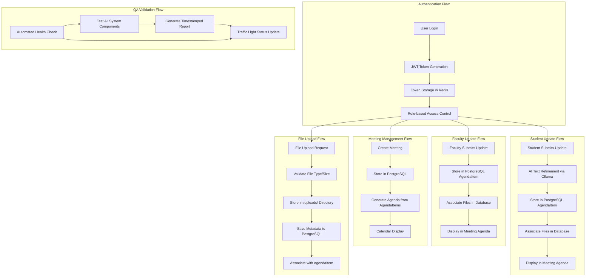
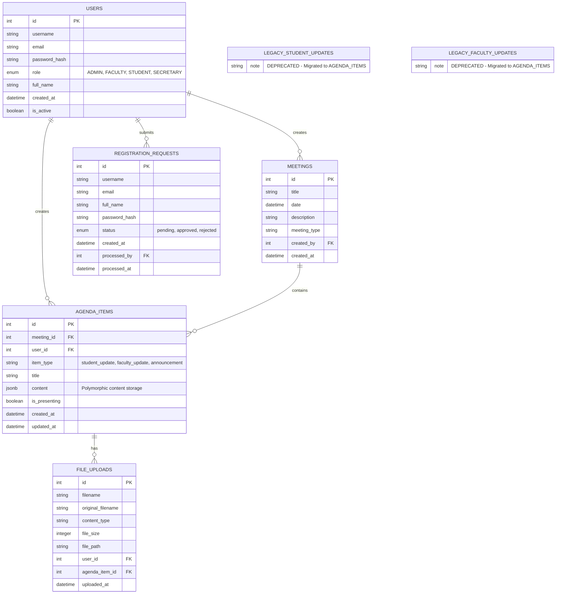
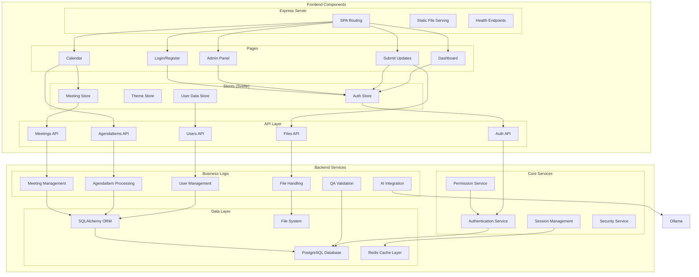
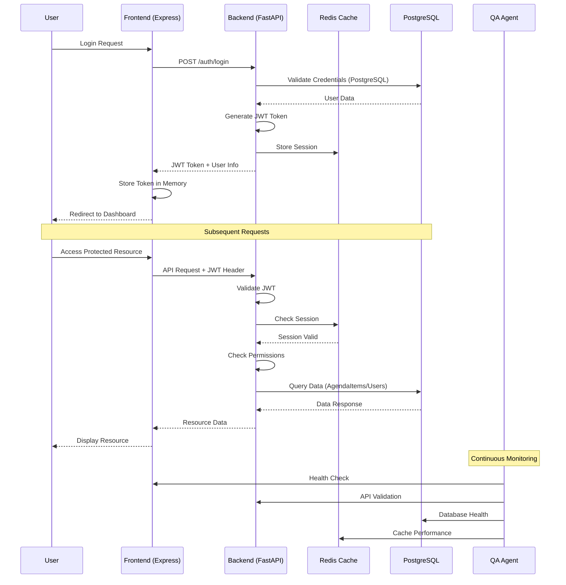
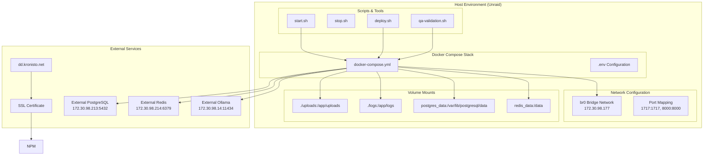

# DoR-Dash Architecture Diagram

**Last Updated:** June 27, 2025  
**System Status:** Production-Ready with Comprehensive Authentication & Repository Cleanup

## System Architecture Overview

```mermaid
graph TB
    subgraph "External Access"
        User[👤 User Browser]
        SSL[🔒 SSL/HTTPS]
    end

    subgraph "Reverse Proxy Layer"
        NPM[📡 Nginx Proxy Manager<br/>dd.kronisto.net]
    end

    subgraph "Docker Network (br0: 172.30.98.177)"
        subgraph "Frontend Container"
            Frontend[🎨 SvelteKit Frontend<br/>Port: 1717<br/>Custom Express Server + SPA Routing]
        end

        subgraph "Backend Container"
            Backend[⚡ FastAPI Backend<br/>Port: 8000<br/>Python/Uvicorn + SQLAlchemy ORM]
        end

        subgraph "Database Container"
            PostgreSQL[(🗄️ PostgreSQL<br/>Port: 5432<br/>Complete Data Persistence<br/>Users, AgendaItems, Meetings)]
        end

        subgraph "Cache Container"
            Redis[(🚀 Redis Cache<br/>Port: 6379<br/>Session & Performance Cache Only)]
        end

        subgraph "AI Container"
            Ollama[🤖 Ollama API<br/>Port: 11434<br/>Gemma 3 4B (CPU/RAM)<br/>Text Refinement]  
        end

        subgraph "QA System"
            QA[📊 Quality Assurance Agent<br/>Automated Testing & Validation<br/>Health Monitoring]
        end
    end

    subgraph "File Storage"
        Uploads[📁 File Storage<br/>/uploads/<br/>Persistent Disk + DB Metadata]
    end

    User --> SSL
    SSL --> NPM
    NPM --> Frontend
    NPM --> Backend
    Frontend --> Backend
    Backend --> PostgreSQL
    Backend --> Redis
    Backend --> Ollama
    Backend --> Uploads
    QA --> Frontend
    QA --> Backend
    QA --> PostgreSQL
    QA --> Redis
```

## Data Flow Architecture (Updated June 2025)



## Database Schema (Unified AgendaItem Model)



## API Endpoints Structure (Current)

```mermaid
graph LR
    subgraph "Authentication API (/auth)"
        Auth1[POST /login]
        Auth2[POST /logout]
        Auth3[GET /profile]
        Auth4[POST /refresh]
    end

    subgraph "User Management API (/users)"
        User1[GET /users]
        User2[POST /users]
        User3[PUT /users/{id}]
        User4[DELETE /users/{id}]
        User5[PUT /users/{id}/role]
    end

    subgraph "Unified Agenda API (/agenda-items)"
        Agenda1[GET /agenda-items]
        Agenda2[POST /agenda-items]
        Agenda3[PUT /agenda-items/{id}]
        Agenda4[DELETE /agenda-items/{id}]
    end

    subgraph "Legacy Updates API (/updates, /faculty-updates)"
        Update1[GET /updates - Student]
        Update2[POST /updates - Student]
        Update3[GET /faculty-updates]
        Update4[POST /faculty-updates]
        Update5[POST /text/refine-text]
    end

    subgraph "Meetings API (/meetings)"
        Meet1[GET /meetings]
        Meet2[POST /meetings]
        Meet3[PUT /meetings/{id}]
        Meet4[DELETE /meetings/{id}]
        Meet5[GET /meetings/{id}/agenda]
    end

    subgraph "Files API (/files)"
        File1[POST /upload]
        File2[GET /{file_id}]
        File3[DELETE /{file_id}]
    end

    subgraph "Registration API (/registration)"
        Reg1[POST /register]
        Reg2[GET /requests]
        Reg3[POST /requests/{id}/approve]
        Reg4[POST /requests/{id}/reject]
    end

    subgraph "QA API (/qa)"
        QA1[GET /health]
        QA2[POST /validate]
        QA3[GET /reports]
    end
```

## Component Architecture (Enhanced)



## Security & Authentication Flow (Updated)



## Deployment Architecture (Docker Compose)



## Current Architecture Status (June 2025)

### ✅ PRODUCTION-READY FEATURES
1. **Robust Authentication System** - JWT with session recovery and token refresh
2. **Presentation Assignment System** - Complete grillometer feedback with file uploads
3. **Meeting Integration** - Seamless presentation assignment display in agendas
4. **Advanced Theme System** - Five themes with accessibility compliance
5. **Repository Organization** - Clean structure with documentation in /docs
6. **MCP Infrastructure** - SSH servers for debugging and container access
7. **Quality Assurance** - Automated testing suite with health monitoring
8. **Deployment Automation** - Smart rebuild scripts with cache busting

### 🎯 CURRENT STATE (June 2025)
- **Authentication:** Comprehensive JWT system with race condition fixes
- **Presentation Management:** Full grillometer system with faculty assignment interface
- **File Management:** Integrated file uploads with presentation assignments
- **Themes:** Five distinct themes with contrast optimization
- **Documentation:** All .md files organized in /docs directory
- **Container Access:** MCP SSH servers for development and debugging
- **Repository:** Clean organization with 47 debug files removed

### 🔧 RECENT MAJOR FIXES (June 2025)
1. **Authentication Overhaul:** Resolved JWT token storage race conditions
2. **Sidebar Visibility Fix:** Fixed missing sidebar after successful login
3. **Repository Cleanup:** Removed 10,489 lines of development clutter
4. **Documentation Organization:** Proper structure with docs in /docs
5. **Deployment Streamlining:** Enhanced Docker deployment with health checks

### 🎉 SYSTEM HIGHLIGHTS
- **Zero Data Loss:** Complete database persistence with proper relationships
- **Secure Authentication:** Token refresh mechanisms with session recovery
- **Faculty Tools:** Grillometer feedback system for presentation guidance
- **User Experience:** Responsive design with accessibility-compliant themes
- **Developer Experience:** MCP infrastructure for efficient debugging
- **Quality Assurance:** Comprehensive testing with automated validation

---

**Architecture Evolution:**
- **V1.0 (2024):** Basic functionality with in-memory storage
- **V2.0 (Early 2025):** Database persistence and unified models
- **V2.1 (June 2025):** Advanced theming and presentation management
- **V2.2 (June 2025):** Complete grillometer system implementation
- **V2.3 (June 2025):** Authentication fixes and repository organization

This architecture provides a production-ready research dashboard with robust authentication, advanced presentation management, and comprehensive quality assurance.