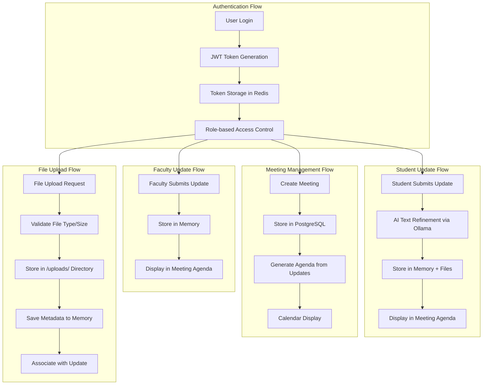
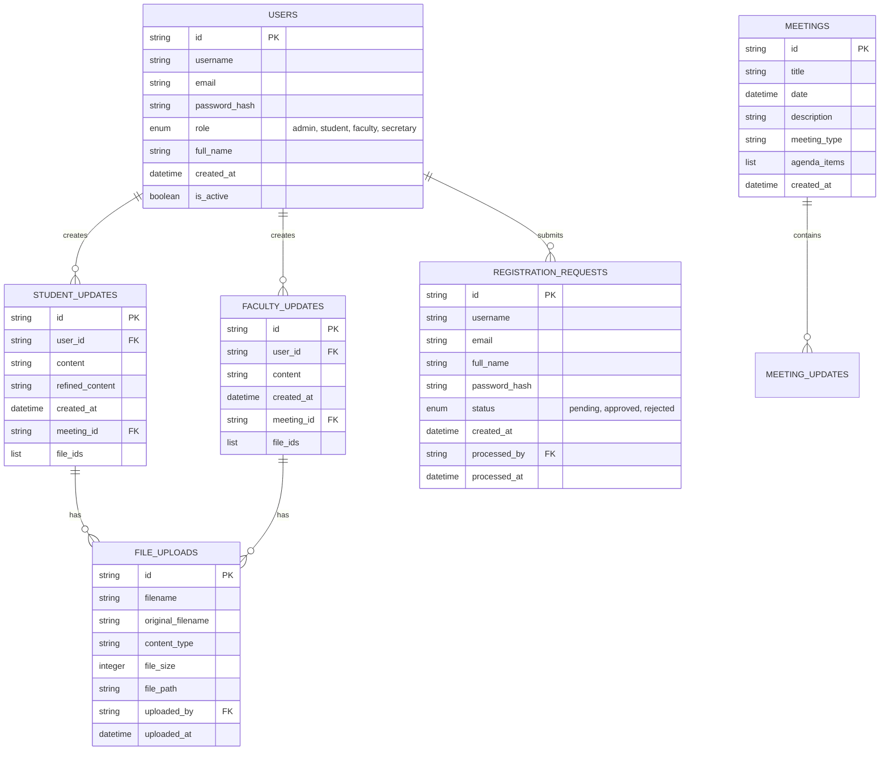
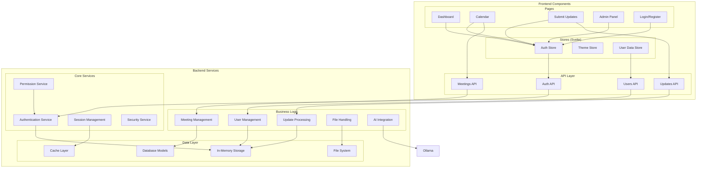
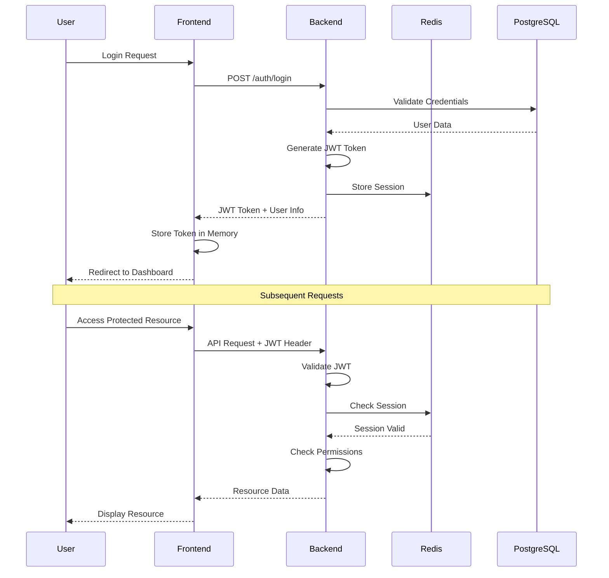
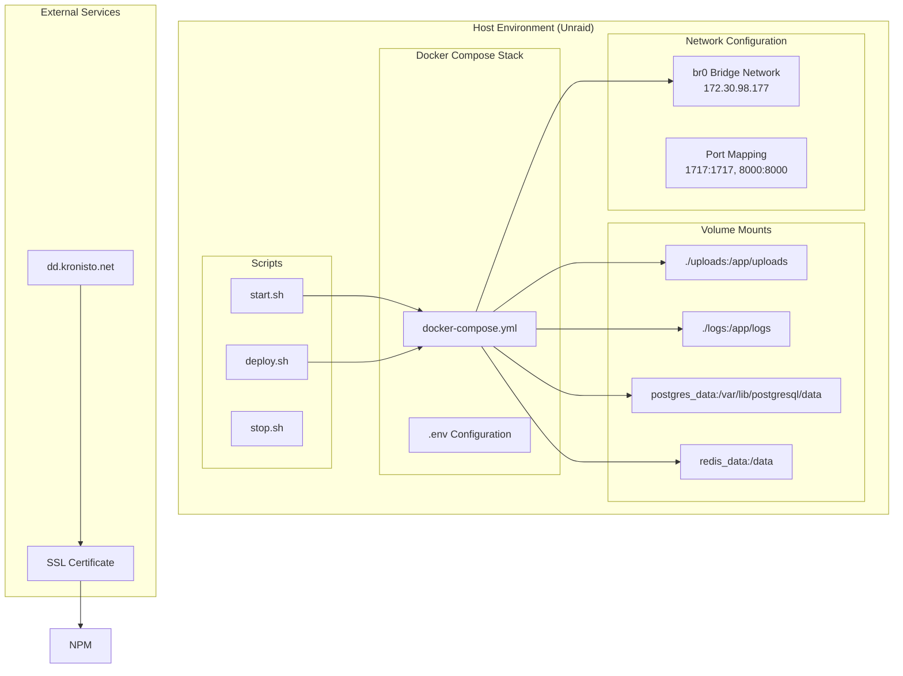

# DoR-Dash Architecture Diagram

## System Architecture Overview

```mermaid
graph TB
    subgraph "External Access"
        User[👤 User Browser]
        SSL[🔒 SSL/HTTPS]
    end

    subgraph "Reverse Proxy Layer"
        NPM[📡 Nginx Proxy Manager<br/>dd.kronisto.net]
    end

    subgraph "Docker Network (br0: 172.30.98.177)"
        subgraph "Frontend Container"
            Frontend[🎨 SvelteKit Frontend<br/>Port: 1717<br/>Vite Dev Server]
        end

        subgraph "Backend Container"
            Backend[⚡ FastAPI Backend<br/>Port: 8000<br/>Python/Uvicorn]
        end

        subgraph "Database Container"
            PostgreSQL[(🗄️ PostgreSQL<br/>Port: 5432<br/>Persistent Storage)]
        end

        subgraph "Cache Container"
            Redis[(🚀 Redis Cache<br/>Port: 6379<br/>Session & Query Cache)]
        end

        subgraph "AI Container"
            Ollama[🤖 Ollama API<br/>Port: 11434<br/>Mistral AI (CPU/RAM)]
        end
    end

    subgraph "File Storage"
        Uploads[📁 File Storage<br/>/uploads/<br/>Persistent Disk]
    end

    User --> SSL
    SSL --> NPM
    NPM --> Frontend
    NPM --> Backend
    Frontend --> Backend
    Backend --> PostgreSQL
    Backend --> Redis
    Backend --> Ollama
    Backend --> Uploads
```

## Data Flow Architecture



## Database Schema



## API Endpoints Structure

```mermaid
graph LR
    subgraph "Authentication API (/auth)"
        Auth1[POST /login]
        Auth2[POST /logout]
        Auth3[GET /me]
        Auth4[POST /refresh]
    end

    subgraph "User Management API (/users)"
        User1[GET /users]
        User2[POST /users]
        User3[PUT /users/{id}]
        User4[DELETE /users/{id}]
        User5[PUT /users/{id}/role]
    end

    subgraph "Updates API (/updates)"
        Update1[GET /student]
        Update2[POST /student]
        Update3[GET /faculty]
        Update4[POST /faculty]
        Update5[POST /refine]
    end

    subgraph "Meetings API (/meetings)"
        Meet1[GET /meetings]
        Meet2[POST /meetings]
        Meet3[PUT /meetings/{id}]
        Meet4[DELETE /meetings/{id}]
        Meet5[GET /meetings/{id}/agenda]
    end

    subgraph "Files API (/files)"
        File1[POST /upload]
        File2[GET /{file_id}]
        File3[DELETE /{file_id}]
    end

    subgraph "Registration API (/registration)"
        Reg1[POST /register]
        Reg2[GET /requests]
        Reg3[POST /requests/{id}/approve]
        Reg4[POST /requests/{id}/reject]
    end
```

## Component Architecture



## Security & Authentication Flow



## Deployment Architecture

